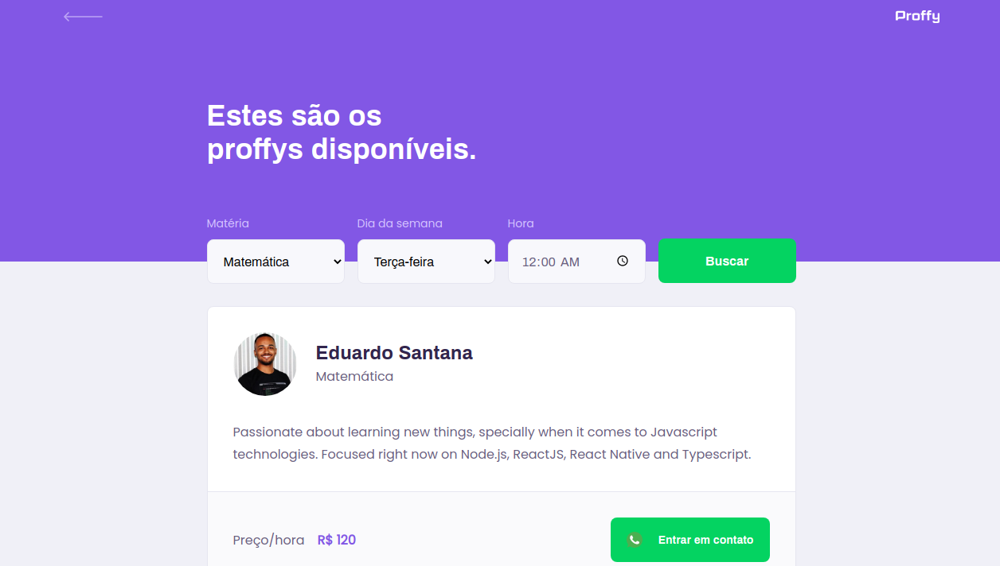
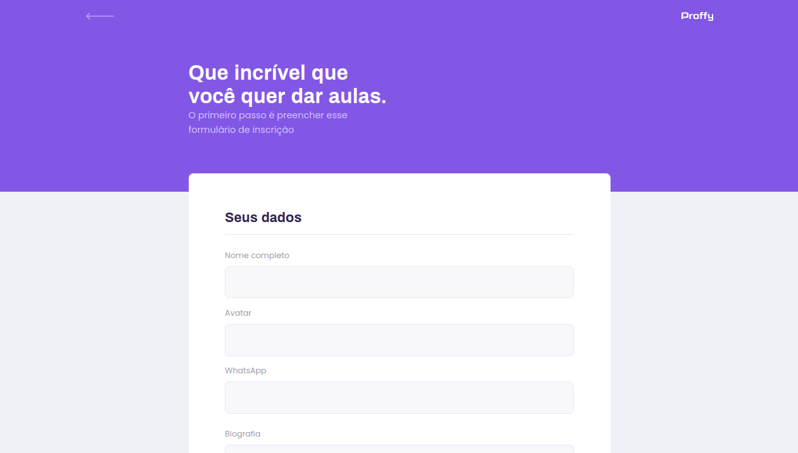
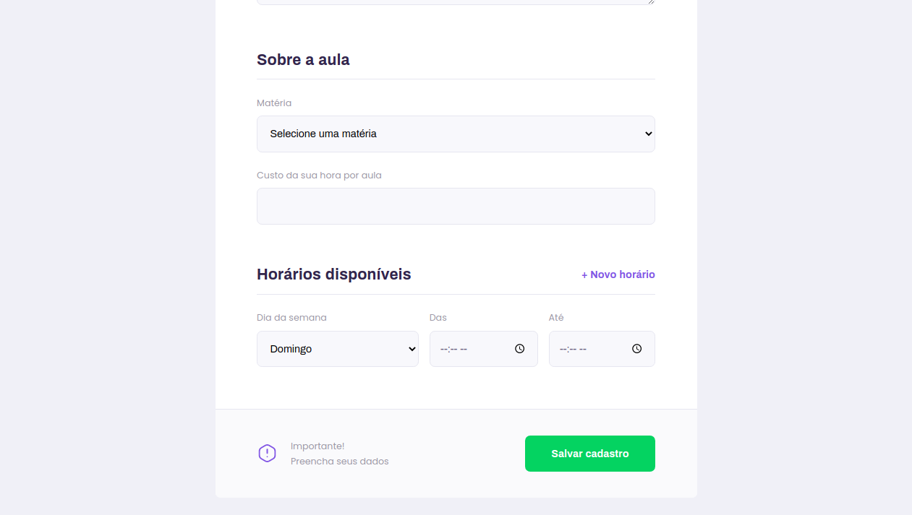

  

<h1 align="center">
  Proffy 👨🏽‍🏫
</h1>

Study when and where wish. Proffy is a software developed to connect students and teachers all over the world 🌍

## Technologies

### Back-End 💻
- Express.js
- Typescript
- Knex
- SQLite3
- Yarn

### Web ⚛️
- ReactJS
- Typescript
- Axios
- React Hooks
- CSS 💅🏽
- Yarn

### Mobile 📱
- React Native
- React Hooks
- Expo CLI
- Axios
- Yarn

# How-To 📚
Running this application is really simple. First of all you need to clone this repository to you workstation: `https://github.com/eduardo3g/proffy.git`

You're also supposed to have NPM or Yarn installed on your machine, Expo CLI and Expo Client app in your cellphone.

- NPM or Yarn - Both of them are package managers. They will be used to get all the required dependencies this project needs to run. Choose one of your
preference.
- Expo CLI - The mobile project developed with React Native depends on Expo, so go check their documentation and follow the installation steps.
- Visual Studio Code (IDE) - Download VS Code as your IDE or choose one that you enjoy the most 🚀
-

Once you have completed all the previous installation steps, it's time to run our application! Let's beggin starting the backend.  

In the root directory we have three folders: `server`, `web` and `mobile`. Move yourself inside each of them and run two commands:  
- `yarn install`: get all the dependencies
- `yarn start`: run the project
 

When you run the commands above inside the `mobile` directory, a new window will be opened in your default browser.
  
After scanning the QRCode in your screen the <b>Expo Client</b> app will be opened in your cellphone running the React Native application.
  
Just wait a few seconds to build then you're done ✅ Hope you enjoy it.

# Preview

## Web 🖥️

  
  
  
  

## Mobile 📱

  
  

# Thank you! 🙋🏽
Made with love by <a target="_blank" href="https://www.linkedin.com/in/eduscaramella/">@eduardo3g</a>. Hope you appreciate it 🔥
